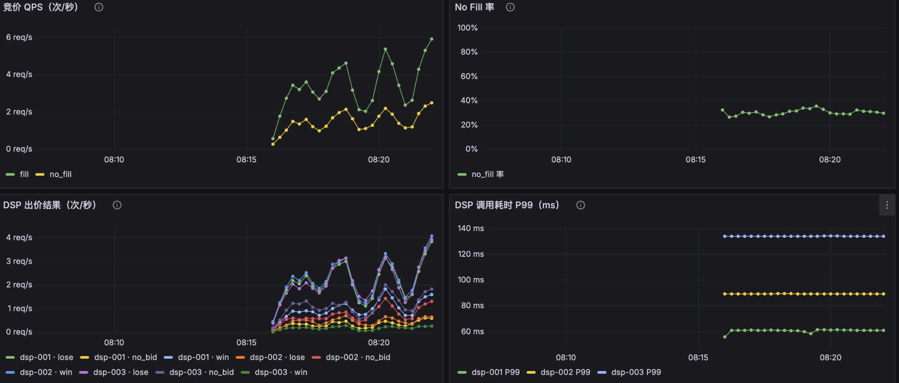

# Mini-SSP

简化版 **SSP（Supply-Side Platform，供给方平台）**，程序化广告里代表媒体方的竞价服务。

接收媒体（App/网站）的广告请求，**并发**向多个 DSP（需求方平台）发起竞价，选出最高出价，返回中标广告。

> 个人学习项目，用来吃透 SSP 竞价链路 + Spring 生态（并发、缓存、限流、消息队列、可观测性等）。

---

## 技术栈

| 组件 | 用途 |
|---|---|
| Spring Boot 3.4.5 / Java 17 | 主框架 |
| MySQL 8 + MyBatis-Plus | 持久化（广告位、DSP 配置、竞价日志） |
| Redis | 配置缓存 + QPS 限流计数 + 竞价结果缓存 |
| Kafka（KRaft 单节点） | bid_log 异步写入，解耦竞价主路径 |
| WebClient（WebFlux） | 异步 HTTP 调用外部 DSP |
| Micrometer + Prometheus + Grafana | 指标采集与监控看板 |
| springdoc-openapi | Swagger 接口文档 |
| Lombok / CompletableFuture | 并发竞价编排 |

---

## 核心竞价流程

```
媒体/App
   │  BidRequest
   ▼
BidController
   │
   ▼
BidService.processBid()
   │
   ├─ 1. SlotCacheService.getSlot()        查广告位（Redis → DB 回源）
   ├─ 2. SlotCacheService.getDspsForSlot() 查关联 DSP 列表
   ├─ 3. FrequencyCapService.isCapped()    过滤已达日频次上限的 DSP
   │
   ├─ 4. 并发 fan-out（每个 DSP 一个 CompletableFuture）
   │      └─ BidService.callDsp()
   │            ├─ RateLimiter.tryAcquire()   Redis INCR QPS 限流
   │            └─ DspCaller.bid()            进程内 Mock / WebClient HTTP
   │
   ├─ 5. allOf().get(globalTimeoutMs)      全局超时收口，迟到的出价直接丢弃
   ├─ 6. 过滤有效出价（price > 0 且 ≥ 底价），选最高
   ├─ 7. PricingStrategy.computeWinPrice() 一价 / 二价计算成交价
   ├─ 8. BidLogWriter.write()              写 bid_log（直写 MySQL / 发 Kafka）
   └─ 9. TrackService.saveBidResult()      中标结果存 Redis（供埋点回调）
   │
   ▼
BidResponse（winDsp、winPrice、adContent、trackUrl）
```

**关键设计**：全局超时到点就用已返回的出价竞价，**不等慢 DSP**——单次竞价耗时 ≈ 最慢的已返回 DSP，而非所有 DSP 之和。

---

## 项目结构

```
mini-ssp/
├── src/main/java/com/example/ssp/
│   ├── controller/
│   │   ├── BidController        POST /api/v1/bid，唯一竞价入口
│   │   ├── TrackController      曝光/点击埋点回调
│   │   ├── SlotAdminController  广告位 CRUD
│   │   ├── DspAdminController   DSP 配置 CRUD
│   │   └── LogController        竞价日志查询
│   │
│   ├── service/
│   │   ├── BidService           核心竞价编排（fan-out、超时、选胜）
│   │   ├── TrackService         曝光/点击处理，写 event_log
│   │   ├── dsp/
│   │   │   ├── DspCaller        接口：调用 DSP 的策略
│   │   │   ├── MockDspCaller    实现 A：进程内模拟（默认）
│   │   │   └── DspBidClient     实现 B：WebClient 真实 HTTP
│   │   ├── pricing/
│   │   │   ├── PricingStrategy  接口：计价策略
│   │   │   ├── FirstPricePricing  一价（付出价）
│   │   │   └── SecondPricePricing 二价（付第二高 + 增量）
│   │   └── bidlog/
│   │       ├── BidLogWriter     接口：bid_log 写入策略
│   │       ├── DirectBidLogWriter  直写 MySQL（默认）
│   │       └── KafkaBidLogWriter   发 Kafka，消费者批量入库
│   │
│   ├── cache/
│   │   ├── SlotCacheService     Cache-Aside：广告位 + DSP 配置缓存
│   │   ├── RateLimiter          Redis INCR 固定窗口 QPS 限流
│   │   └── FrequencyCapService  用户日频次上限控制
│   │
│   ├── config/
│   │   ├── ThreadPoolConfig     bidExecutor 线程池（core=8, max=16）
│   │   ├── RedisConfig          RedisTemplate 序列化配置
│   │   └── WebClientConfig      WebClient Bean
│   │
│   ├── filter/
│   │   └── TraceFilter          每个请求注入 traceId（MDC），贯穿全链路日志
│   │
│   ├── aspect/
│   │   └── LogAspect            AOP 记录接口耗时
│   │
│   ├── model/
│   │   ├── entity/              AdSlot, DspConfig, SlotDspRel, BidLog, EventLog
│   │   ├── dto/                 BidRequest/Response, DspBidRequest/Response
│   │   ├── vo/                  ApiResponse（统一响应包装）
│   │   └── enums/               AdSlotType, BidStatus, EventType
│   │
│   ├── mapper/                  MyBatis Mapper 接口
│   ├── consumer/
│   │   └── BidLogConsumer       @KafkaListener 批量消费，insertBatch 入库
│   └── exception/
│       ├── BizException
│       └── GlobalExceptionHandler
│
├── mock-dsp/                    独立 Mock DSP 服务（一份代码 profile 起三实例）
├── docker/
│   └── docker-compose.yml       Kafka + Prometheus + Grafana（profiles 按需启动）
├── scripts/
│   ├── stress_test.py           压测脚本（支持 --concurrency --duration）
│   └── test-modeB.sh            Mode B 端到端自动化测试
└── start.sh                     一键启动入口
```

---

## 快速开始

### 前置条件

- Java 17+，Maven（或用项目自带的 `./mvnw`）
- MySQL 8（库 `mini_ssp`）、Redis 已启动
- Docker Desktop（如需 Kafka / 监控）

### 一键启动

```bash
# 基础版（MySQL + Redis 用 brew，只起 Java 应用）
./start.sh

# 加 Kafka（bid-log 异步写入）
./start.sh --kafka

# 加监控（Prometheus + Grafana）
./start.sh --metrics

# 全量
./start.sh --kafka --metrics

# 停止 Docker 服务
./start.sh --down --kafka --metrics
```

`start.sh` 会依次：自动清理 8080 端口残留进程 → 启动 brew MySQL/Redis → 启动对应 Docker 服务 → 前台运行 Java 应用。

### 数据库初始化

```sql
CREATE DATABASE IF NOT EXISTS mini_ssp DEFAULT CHARSET utf8mb4;
USE mini_ssp;
-- 建表 DDL 见 dev.md §5.6
```

### 配置敏感信息

```bash
cp .env.example .env   # 填入 DB_PASSWORD
```

`spring-dotenv` 启动时自动加载根目录 `.env`。

---

## API 文档

统一响应格式：`{ "code": 0, "message": "success", "data": {} }`
- `code: 0` = 成功
- `code: 1` = no fill（无有效出价）
- `code: 404/500` = 错误

Swagger UI：http://localhost:8080/swagger-ui.html

### 竞价

```
POST /api/v1/bid
```

```json
// 请求
{
  "id": "req-001",
  "tagid": "slot-test-001",
  "device": { "os": "iOS" },
  "user": { "id": "u1" }
}

// 响应（中标）
{
  "code": 0,
  "data": {
    "winDsp": "dsp-002",
    "winPrice": 7.30,
    "adContent": {
      "title": "来自 dsp-002 的广告",
      "impressionTrackUrl": "/api/v1/track/impression?rid=req-001",
      "clickTrackUrl": "/api/v1/track/click?rid=req-001"
    }
  }
}
```

### 埋点回调

| 方法 | 路径 | 说明 |
|---|---|---|
| GET | `/api/v1/track/impression?rid={requestId}` | 曝光上报（204），同时触发频次计数 |
| GET | `/api/v1/track/click?rid={requestId}` | 点击上报（302 跳转落地页） |

### 管理接口

| 方法 | 路径 | 说明 |
|---|---|---|
| GET/POST/PUT/DELETE | `/api/v1/admin/slots` | 广告位 CRUD |
| GET/POST/PUT/DELETE | `/api/v1/admin/dsps` | DSP 配置 CRUD |
| GET | `/api/v1/admin/logs` | 竞价日志分页查询 |

---

## 关键配置开关

| 配置项 | 默认值 | 说明 |
|---|---|---|
| `ssp.dsp.mode` | `mock` | `mock`=进程内模拟 DSP / `http`=WebClient 真实调用 |
| `ssp.bid-log.mode` | `direct` | `direct`=同步写 MySQL / `kafka`=发 Kafka 异步入库 |
| `ssp.bid.auction-type` | `first` | `first`=一价 / `second`=二价（付第二高价 + 增量） |
| `ssp.bid.global-timeout-ms` | `200` | 全局竞价超时（ms） |
| `ssp.bid.default-dsp-timeout-ms` | `150` | 单个 DSP 超时（ms） |
| `ssp.cache.enabled` | `false` | 广告位/DSP 配置是否走 Redis 缓存 |
| `ssp.freq.daily-cap` | `3` | 同一用户同一 DSP 每日最多展示次数（0=不限） |

启动时覆盖示例：

```bash
# 多参数用 jvmArguments 以 -D 系统属性传
./mvnw spring-boot:run \
  "-Dspring-boot.run.jvmArguments=-Dssp.dsp.mode=http -Dssp.bid.auction-type=second"
```

---

## Redis 键设计

| Key 格式 | TTL | 用途 |
|---|---|---|
| `ssp:slot:{slotId}` | 10 min | 广告位配置缓存 |
| `ssp:slot_dsps:{slotId}` | 10 min | 广告位关联的 DSP 列表 |
| `ssp:dsp:{dspId}` | 10 min | DSP 配置缓存 |
| `ssp:rate:{dspId}:{yyyyMMddHHmmss}` | 2 sec | QPS 限流计数（INCR） |
| `ssp:bid_result:{requestId}` | 5 min | 中标结果（供埋点回调读取） |
| `ssp:freq:{userId}:{dspId}:{yyyyMMdd}` | 当天到期 | 用户日频次计数 |

---

## 数据库表

| 表名 | 说明 |
|---|---|
| `ad_slot` | 广告位配置（尺寸、类型、底价、状态） |
| `dsp_config` | DSP 配置（竞价 URL、超时、QPS 上限） |
| `slot_dsp_rel` | 广告位与 DSP 的多对多关联 |
| `bid_log` | 每次竞价每个 DSP 的出价记录（价格、状态、是否中标） |
| `event_log` | 曝光/点击事件记录 |

---

## DSP 模式

### Mode A（默认，进程内模拟）

无需启动任何外部服务，`MockDspHandler` 在同一进程内模拟出价逻辑和延迟。适合开发调试。

```bash
./start.sh   # ssp.dsp.mode=mock（默认）
```

### Mode B（真实 HTTP 调用）

启动 3 个独立 Mock DSP 服务（8081/8082/8083），SSP 通过 WebClient 发起真实 HTTP 竞价请求。
dsp-c（8083）会模拟偶发超时/异常，可测试 SSP 的容错能力。

```bash
# 分别在三个终端启动 Mock DSP
cd mock-dsp
./mvnw spring-boot:run -Dspring-boot.run.profiles=dsp-a   # 8081
./mvnw spring-boot:run -Dspring-boot.run.profiles=dsp-b   # 8082
./mvnw spring-boot:run -Dspring-boot.run.profiles=dsp-c   # 8083（会超时/报错）

# SSP 切换为 http 模式
./mvnw spring-boot:run "-Dspring-boot.run.jvmArguments=-Dssp.dsp.mode=http"
```

或一键端到端测试（自动起停所有服务，发请求，汇总结果，导出 bid_log）：

```bash
./scripts/test-modeB.sh 20 test-results slot-test-001 second
#                        ↑     ↑              ↑            ↑
#                      请求数  结果目录      广告位 ID    拍卖方式
```

结果归档到 `test-results/modeB-<timestamp>/`（summary / requests.jsonl / bid_log.tsv / 各服务日志）。

---

## 压测

```bash
# 默认：50 并发，60 秒
python3 scripts/stress_test.py

# 自定义参数
python3 scripts/stress_test.py --concurrency 100 --duration 30

# 指定基础设施场景
python3 scripts/stress_test.py --scenario 2   # 1=基础 2=+缓存 3=+Kafka
```

**关键压测结论**（latency=0，本机测试）：

| 并发数 | QPS | P99 | 说明 |
|---|---|---|---|
| 25 | 157 req/s | 382ms | 吞吐峰值 |
| 50 | 108 req/s | 862ms | 开始排队 |
| 100 | 105 req/s | 1688ms | 饱和平台期 |
| 200 | 105 req/s | 3496ms | 2.8% 超时错误 |

饱和点在 c=25（~157 req/s），之后吞吐不增、延迟线性增长，是典型资源池耗尽特征。

---

## 可观测性

### Prometheus + Grafana

```bash
./start.sh --metrics
```

- Prometheus：http://localhost:9090
- Grafana：http://localhost:3000（admin / admin，含预配置看板）

指标覆盖：竞价 QPS、Fill Rate、各 DSP 出价结果分布、DSP 调用耗时（P50/P95/P99）、整体竞价耗时。



常用 PromQL：

```promql
# Fill QPS
sum(rate(ssp_bid_requests_total{result="fill"}[1m]))

# No Fill 率
sum(rate(ssp_bid_requests_total{result="no_fill"}[1m]))
  / sum(rate(ssp_bid_requests_total[1m]))

# 竞价 P99 耗时
histogram_quantile(0.99, rate(ssp_bid_duration_seconds_bucket[1m]))
```

### 链路日志

每个请求自动注入 `traceId`（由 `TraceFilter` 写入 MDC），所有日志行均携带，方便追踪单次竞价全链路。

```
[traceId=abc123] [Bid] slot=slot-test-001, dsps=3
[traceId=abc123] [DSP] dsp-002 bid=7.30, cost=85ms
[traceId=abc123] [Bid] winner=dsp-002, price=7.30
```

---

## 测试

```bash
./mvnw test                          # 全部
./mvnw test -Dtest=BidServiceTest    # 单个类
```

| 测试类 | 类型 | 说明 |
|---|---|---|
| `BidServiceTest` | 单元 | 竞价决策逻辑（无需 DB/Redis） |
| `PricingStrategyTest` | 单元 | 一价/二价计算 |
| `RateLimiterTest` | 单元 | QPS 限流逻辑 |
| `*ControllerTest` | 集成 | 需要 MySQL + Redis |

---

## 设计模式

| 模式 | 应用 |
|---|---|
| **策略模式** | `DspCaller`（Mock/Http）、`PricingStrategy`（一价/二价）、`BidLogWriter`（直写/Kafka）三组策略，`@ConditionalOnProperty` 按配置切换 |
| **Cache-Aside** | `SlotCacheService`：先读 Redis，miss 则查 DB 并回写 |
| **并发 Fan-out** | `CompletableFuture.supplyAsync` + `bidExecutor` 线程池，所有 DSP 并发发起，`allOf().get(timeout)` 统一收口 |
| **异步解耦** | Kafka 把 bid_log 写入从竞价主路径剥离，消费者批量入库，P99 延迟降低约 100ms |


